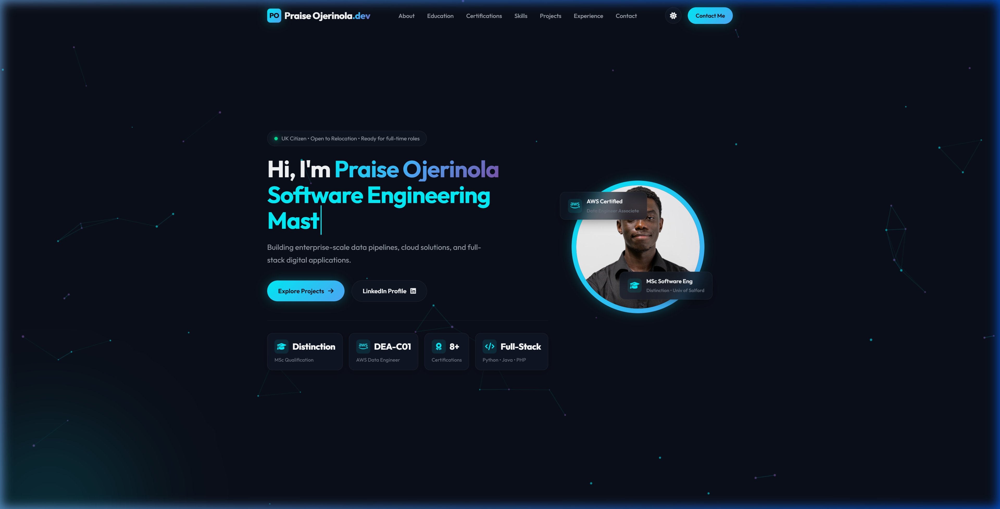
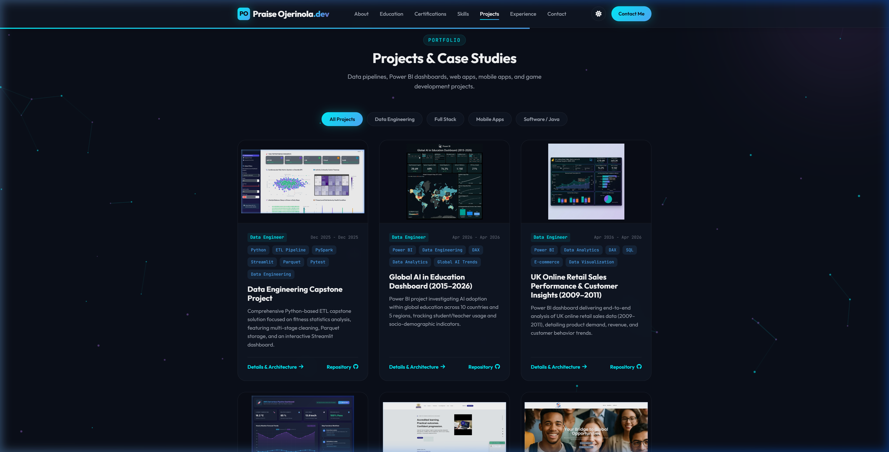
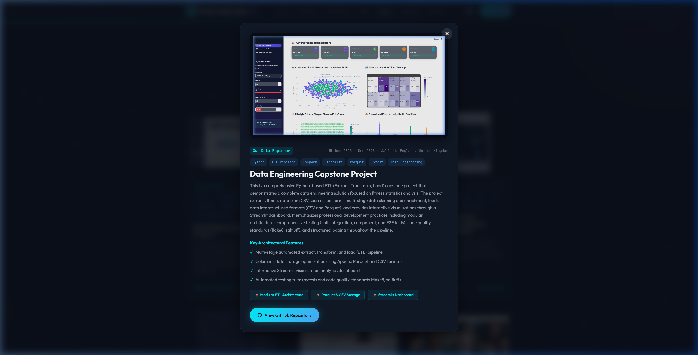
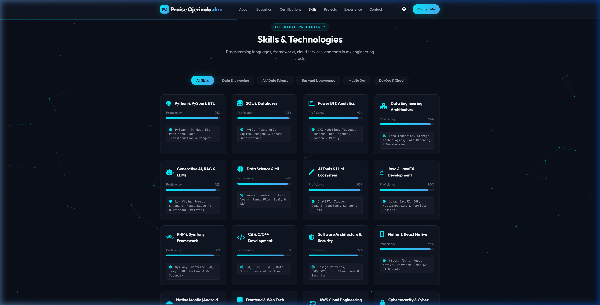

# Praise Ojerinola — Portfolio Website

[](https://www.credly.com/badges/53369df2-187c-4b08-9ed8-18911445242d/public_url)
[](AWS_DEPLOYMENT.md)
[-00F2FE?style=for-the-badge&logo=academic&logoColor=black)](#)
[](LICENSE)

A modern, high-performance, dark-themed personal portfolio website built with Vanilla HTML5, CSS3, and JavaScript. Designed to showcase AWS Data Engineering pipelines, Power BI analytics dashboards, full-stack web platforms, mobile applications, and academic achievements.

---

## 📸 Website Previews

### 🌟 Hero Section & Glassmorphic Stat Cards


### 📊 Projects & Case Studies Showcase


### 🔍 Interactive Project Detail Modal


### ⚡ Technical Proficiency & Skills Grid


---

## ✨ Features

- **⚡ Interactive Canvas Particle Engine:** Custom canvas-based particle system with smooth physics and ambient dark mode styling.
- **🚀 Dynamic Project Showcase & Filtering:** Real-time filtering across Data Engineering, AI / Data Science, Full-Stack, Mobile Dev, and Game Engineering.
- **🔍 Rich Project Detail Modals:** Uncropped, aspect-ratio preserved project modal overlays featuring role badges, metrics, architectural features, GitHub repository links, and live deployment URLs.
- **💎 Glassmorphic Design System:** Sleek dark glassmorphic cards, glowing badges, vibrant HSL gradients, smooth micro-interactions, and custom typography (*Outfit*, *Plus Jakarta Sans*, *Fira Code*).
- **📜 Verified Certifications & Education:** Direct Credly credential verification for AWS Certified Data Engineer (DEA-C01), Google AI Professional, IBM Agile Explorer, and University of Salford degrees.
- **🛡️ Honeypot Anti-Spam Protection:** Hidden honeypot field in the contact form that catches automated bot submissions while remaining invisible to real users.

---

## 🛠️ Technology Stack

- **Core Technologies:** HTML5, CSS3 (Vanilla Design System), Modern JavaScript (ES6+)
- **UI Components:** Custom Glassmorphism, FontAwesome 6, Google Fonts
- **Data Configuration:** Centralized `portfolioConfig` architecture (`js/config.js`)
- **Anti-Spam:** Honeypot field with CSS hiding and JavaScript validation

---

## 📂 Project Directory Structure

```
Portfolio_website/
├── assets/
│   └── images/          # Project screenshots, portrait photos, and icons
├── css/
│   └── styles.css       # Core design system, tokens, layout, modal, and honeypot styles
├── js/
│   ├── config.js        # Central portfolio data (projects, skills, certs)
│   └── main.js          # Component renderers, filters, canvas background, honeypot validation
├── index.html           # Main application HTML page
├── README.md            # Repository documentation
└── LICENSE              # MIT License file
```

---

## 🚀 Featured Projects

### AWS Serverless Data Pipeline & Analytics Platform
Enterprise-grade, event-driven serverless data pipeline and real-time analytics platform built on AWS using TDD and Infrastructure as Code (AWS SAM). Features Step Functions orchestration, dual-engine storage (S3 Parquet + DynamoDB), Athena SQL querying, and an interactive Chart.js analytics dashboard.
- **GitHub:** [aws-serverless-data-pipeline](https://github.com/praiseOjay/aws-serverless-data-pipeline)

### Data Engineering Capstone Project
Comprehensive Python-based ETL capstone solution with multi-stage cleaning, Parquet storage, and an interactive Streamlit dashboard.
- **GitHub:** [capstone_project](https://github.com/praiseOjay/capstone_project)

### Advert Marketplace Website
Classifieds marketplace application built with PHP, Symfony, Doctrine ORM, and MySQL featuring full CRUD, search, pagination, and admin moderation.
- **Live Demo:** [Marketplace (AWS)](https://jkjl56qvog.execute-api.eu-west-2.amazonaws.com/)
- **GitHub:** [Marketplace_website](https://github.com/praiseOjay/Marketplace_website)

### Global AI in Education Dashboard (2015–2026)
Power BI project investigating AI adoption within global education across 10 countries and 5 regions.
- **GitHub:** [Global_AI_in_Education](https://github.com/praiseOjay/Global_AI_in_Education)

---

## 🚀 How to Run Locally

Because the portfolio is built with modern web standard modules and HTML5 assets, it can be served using any static web server:

### Option 1: Python HTTP Server (Recommended)
```bash
# Serves website on http://localhost:8080
python -m http.server 8080
```

### Option 2: Node.js `serve`
```bash
npx serve .
```

---

## 👨‍💻 About Praise Ojerinola

- **Role:** AWS Certified Data Engineer & Software Engineering Master's Graduate (Distinction)
- **Location:** Salford, England, United Kingdom
- **Email:** [ojerinolapraise@gmail.com](mailto:ojerinolapraise@gmail.com)
- **LinkedIn:** [linkedin.com/in/praise-ojerinola-4125311b6](https://linkedin.com/in/praise-ojerinola-4125311b6)
- **GitHub:** [github.com/praiseOjay](https://github.com/praiseOjay)
- **HyperionDev Portfolio:** [hyperiondev.com/portfolio/PO25010016717](https://hyperiondev.com/portfolio/PO25010016717/)

---

## 📄 License

This project is open source and available under the [MIT License](LICENSE).
